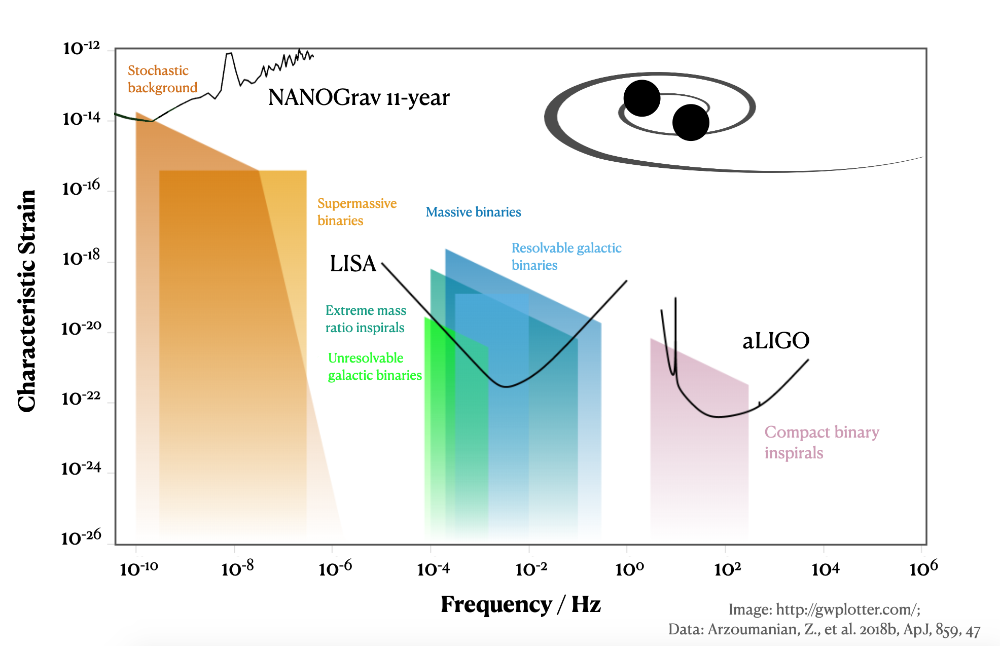

*tl:dr; Pulsar timings arrays are nature-made, galactic-scale collections of rapidly rotating neutron stars monitored by radio telescopes. Anamolies in their apparent rotation rate may evidence the stretch and squeeze of spacetime due to very distant black holes.*

You may not know it but astronomy was revolutionized in 2015. 

Up until then, the study of space was limited to light. We've understood the formation and lifecycle of stars via brilliant supernovae; the first few seconds of our universe are imprinted in 2.7 degree Kelvin photons we see in every direction; even the theory of general relativity was evidenced through the bending of light during an eclipse in 1919. But, in 2015, we discovered that we don't need to point telescopes at the sky to witness some astrophysical phenomena. 

We can observe gravity. 

Specifically, we can observe a corollary of Einstein's Theory of General Relativity: gravitational waves. 

There are many analogs to light, but instead of giving you a series of comparisons, let's describe gravitional waves by first tackling General Relativity. It's OK, you can get through it!

We've discussed the theory behind gravitational waves and some of the most intriguing sources. Now, let's talk about how we detect them. There are buckets full of articles discussing LIGO, the ground-based gravitational wave detector that was the first to successfully measure the gravitational waves from a binary black hole merger. 

In a previous post I walked you through how supermassive black holes whipping around each other lead to traveling ripples in spacetime. 

When I was a researcher for the North American Nanohertz Observatory for Gravitational Waves [(NANOGrav)](http://nanograv.org/) I knew the experiment I was working on was cool --  I just didn't fully grok *how* cool it is. 

Donec vitae vestibulum purus. Donec molestie commodo mauris in placerat. Nunc quis leo id dolor viverra luctus. Mauris at ipsum mi. Sed lorem leo, consectetur eget lorem in, pretium feugiat elit. Ut eget egestas sapien. Pellentesque sed metus turpis. Aenean rhoncus scelerisque finibus. Nam ultricies at orci ac efficitur. Donec eget auctor ex, ornare blandit nisl. Curabitur quis elit non enim sollicitudin ultricies. Donec sit amet ligula et velit vestibulum iaculis sed a turpis. Donec imperdiet sapien ut libero cursus dignissim.

{: .mx-auto.d-block :}
