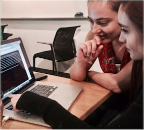
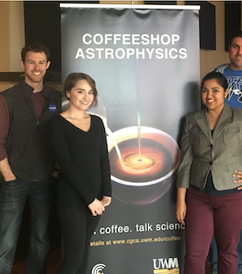

#### ​Seattle, WA

## SKILLS

**Programming Languages:** Python, SQL  
**Tools:** Pandas, NumPy, Sklearn, Matplotlib, statsmodels, PyMC3, git, Google Colab, AWS  
**Methods:** statistical modeling, bayesian inference, time-domain modeling  
{:style="float: right;margin-right: 7px;margin-top: 7px;"}

## EXPERIENCE
#### Data Scientist, ​ Nordstrom, ​Seattle, WA October 2020 - Present

#### Data Science Fellow, ​ Insight, ​Seattle, WA May 2020 - October 2020

- Built an end-to-end, python-based web application aiming to serve a diverse set of consumers find the
best-rated cosmetics for their skin tone
- Scraped over 40k product reviews to train a random forest algorithm to predict personalized,
complementary product colors
- Deployed model through an interactive dashboard powered by Streamlit, hosted on Amazon Web Services

#### Data Analyst, ​ North American Nanohertz Observatory for Gravitational Waves ​ May 2019 - August 2019

- Enhanced signal-search pipelines performing data analysis on 15+ years of radio telescope data to
detect the influence of long-period gravitational waves from supermassive black holes
- Used cluster computing to explore 100+ dimensional statistical models and constrained strength of
gravitational signals from resulting posterior distributions; used these limits to infer black hole binary
population properties
- Diagnosed and tailored signal search pipelines to decouple correlated time signatures and mitigate false alarms

#### Postdoctoral Research Associate, ​ UW-Milwaukee, ​Milwaukee, WI May 2019 - August 2019

- Adapted binary black hole simulation to incorporate physics of low-mass binaries; results forecast first
gravitational-wave impulse detection by next-generation instruments
- Collaborated with >20 scientists to produce 8+ publications

#### Graduate Research Associate, ​ UW-Milwaukee, ​Milwaukee, WI September 2012 - May 2019

- Developed accelerated metric to evaluate evidence of stochastic gravitational-wave signals in pulsar
timing data sets; retrieves outcomes in minutes as opposed to weeks
- Led student workshop at collaboration conference covering data analysis theory and applied protocol
for model selection and parameter estimation
- Spearheaded 5+ presentations through science-cafe series and created translation strategies to share
abstract physics concepts with non-expert audiences of > 100 in metro-area Milwaukee  

{: width=202 height=180 style="float: left;margin-left: 7px;margin-top: 7px;"}

## EDUCATION  
**University of Wisconsin-Milwaukee** 2019    
Ph.D., Astrophysics  
**University of Wisconsin - Milwaukee** 2012    
B.S., Physics

